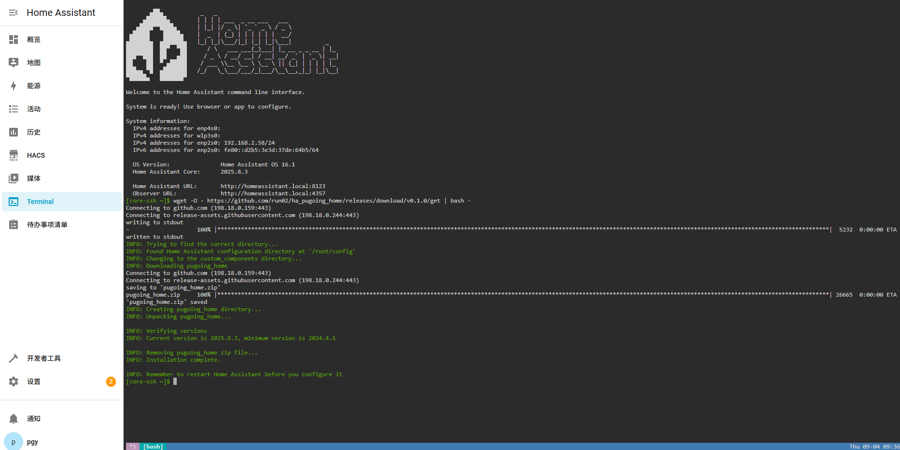
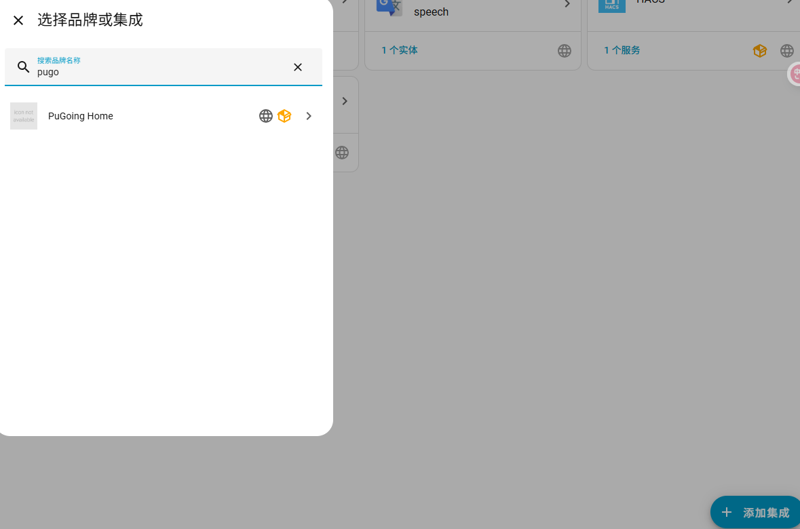
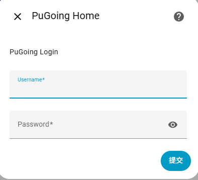
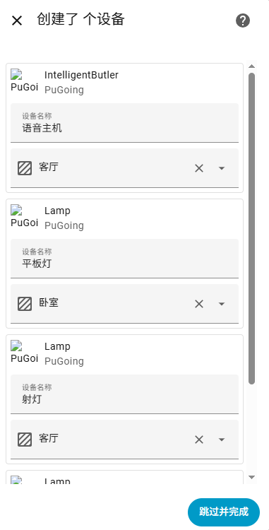
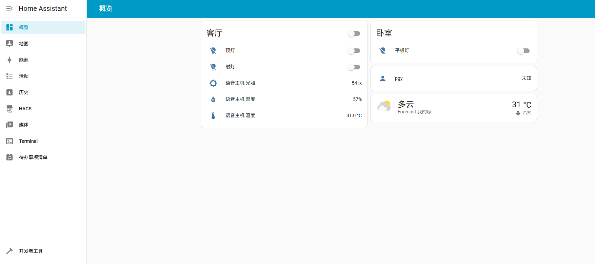

ha_pugoing_home 

### Install PuGoing Home Intergration

#### container

To set up `PuGoing Home`, you can use the [`PuGoing Home` download script](https://github.com/run02/ha_pugoing_home/releases/download/v0.1.0/get).

1. Open a terminal.

2. Go inside the container with `docker exec -it <name of the container running homeassistant> bash`.

3. Run the `PuGoing Home` download script.

   ```sh
   wget -O - https://github.com/run02/ha_pugoing_home/releases/download/v0.1.0/get | bash -
   ```

##### Finalizing steps

1. Restart Home Assistant.
2. Follow the steps on [setting up the `PuGoing Home` integration](https://github.com/run02/ha_pugoing_home/blob/main/README.md).

#### core

To set up `PuGoing Home`, you can use the [`PuGoing Home` download script](https://github.com/hacs/get).

1. Open a terminal.

2. Change to the user that is running Home Assistant.

3. Run the `PuGoing Home` download script.

   ```sh
   wget -O - https://github.com/run02/ha_pugoing_home/releases/download/v0.1.0/get | bash -
   ```

##### Finalizing steps

1. Restart Home Assistant.
2. Follow the steps on [setting up the `PuGoing Home` integration](https://github.com/run02/ha_pugoing_home/blob/main/README.md).

#### .



### Setting up the PuGoing Home intergation










	